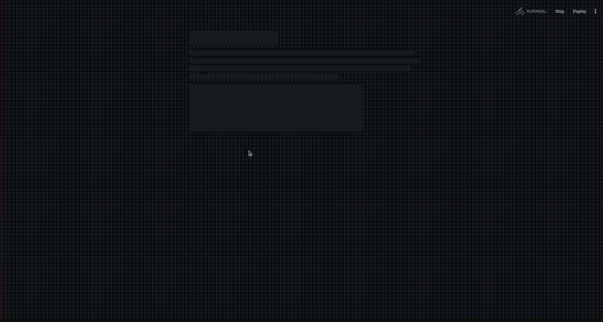

<!-- Improved compatibility of back to top link: See: https://github.com/othneildrew/Best-README-Template/pull/73 -->
<a id="readme-top"></a>
<!--
*** Thanks for checking out the Best-README-Template. If you have a suggestion
*** that would make this better, please fork the repo and create a pull request
*** or simply open an issue with the tag "enhancement".
*** Don't forget to give the project a star!
*** Thanks again! Now go create something AMAZING! :D
-->


<!-- PROJECT SHIELDS -->
<!--
*** I'm using markdown "reference style" links for readability.
*** Reference links are enclosed in brackets [ ] instead of parentheses ( ).
*** See the bottom of this document for the declaration of the reference variables
*** for contributors-url, forks-url, etc. This is an optional, concise syntax you may use.
*** https://www.markdownguide.org/basic-syntax/#reference-style-links
-->
<!-- [![Contributors][contributors-shield]][contributors-url]
[![Forks][forks-shield]][forks-url]
[![Stargazers][stars-shield]][stars-url]
[![Issues][issues-shield]][issues-url]
[![MIT License][license-shield]][license-url]
[![LinkedIn][linkedin-shield]][linkedin-url]
 -->


<h3 align="center">Badminton Video Trimmer</h3>

<!-- TABLE OF CONTENTS -->
<details>
  <summary>Table of Contents</summary>
  <ol>
    <li>
      <a href="#about-the-project">About The Project</a>
      <ul>
        <li><a href="#motivation">Motivation</a></li>
        <li><a href="#demo">Demo</a></li>
        <li><a href="#built-with">Built With</a></li>
      </ul>
    </li>
    <li>
      <a href="#getting-started">Getting Started</a>
      <ul>
        <li><a href="#prerequisites">Prerequisites</a></li>
        <li><a href="#installation">Installation</a></li>
      </ul>
    </li>
    <li><a href="#resource-usage">Resource Usage</a></li>
    <li><a href="#acknowledgments">Acknowledgments</a></li>
  </ol>
</details>


<!-- ABOUT THE PROJECT -->

## About The Project

<!-- [![Product Name Screen Shot][product-screenshot]](https://example.com) -->

This project helps you create a summary video of a badminton match from a full-match video on Youtube. The summary video
contain only the rallies.

### Motivation:

- My love for badminton 🏸
- My curiosity about Machine Learning and Computer Vision
- My frustration of getting started
  with [state-of-the-art Temporal Action Detection models](https://paperswithcode.com/sota/temporal-action-localization-on-thumos14)
  as a newbie

### Demo

This demo is playing at 2x speed.



<p align="right">(<a href="#readme-top">back to top</a>)</p>

### Built With

* [![Streamlit][streamlit]][streamlit-url]
* [![Torch][torch]][torch-url]
* [![ffmpeg][ffmpeg]][ffmpeg-url]
* [![opencv][opencv]][opencv-url]

<p align="right">(<a href="#readme-top">back to top</a>)</p>


<!-- GETTING STARTED -->

## Getting Started

### Prerequisites

* [**ffmpeg**][ffmpeg-url]
    * It is used for images and video processing.
    * Check if `ffmpeg` is installed on your machine with `ffmpeg --version`. The command should output something like
      `ffmpeg version 4.4.2-0ubuntu0.22.04.1+esm5 Copyright (c) 2000-2021 the FFmpeg developers  built with gcc 11 (Ubuntu 11.4.0-1ubuntu1~22.04)`

* [**Conda**](https://docs.anaconda.com/miniconda/) for creating python virual environment
  ```sh
  conda create --name trimmer python=3.8
  conda activate trimmer
  ```

### Installation

1. Install python packages

```sh
pip install -r requirments.txt
```

2. Run the streamlit app

```sh
streamlit run src/main.py  
```

#### With Docker

1. Buld the image
   `docker build -t trimmer .`
2. Run docker image as a container
   `docker run -p 8501:8501  trimmer:latest`

*Notes*: Inside the container, data is stored under `/app/data`, so to mount a volume from your host to the container,
use this command:
`docker run -p 8501:8501 -v <path/to/data/dir>:/app/data --ipc=host  trimmer:latest`

You can now access the app via `localhost:8501`.

<p align="right">(<a href="#readme-top">back to top</a>)</p>

## Resource usage

- Your machine should have **at least 4 CPUs and 16 GB RAM free** for the app to run.
- No GPU needed.

<p align="right">(<a href="#readme-top">back to top</a>)</p>

<!-- ACKNOWLEDGMENTS -->

## Acknowledgments

I am very thankful to the authors of these two papers:

- [An Empirical Study of End-to-end Temporal Action Detection](https://arxiv.org/abs/2204.02932) for their great TAD
  model architecture and the detailed documentation.
- [S2-Labeling: Shot-By-Shot Microscopic Badminton
  Singles Tactical Dataset](https://ieeexplore.ieee.org/document/9919982) for their high quality dataset.

<p align="right">(<a href="#readme-top">back to top</a>)</p>

<!-- MARKDOWN LINKS & IMAGES -->
<!-- https://www.markdownguide.org/basic-syntax/#reference-style-links -->

[//]: # (get badges at https://github.com/Ileriayo/markdown-badges)

[//]: # ([Next-url]: https://nextjs.org/)

[streamlit]: https://img.shields.io/badge/Streamlit-%23FE4B4B.svg?style=for-the-badge&logo=streamlit&logoColor=white

[streamlit-url]: https://streamlit.io/

[torch-url]: https://pytorch.org/

[torch]: https://img.shields.io/badge/PyTorch-%23EE4C2C.svg?style=for-the-badge&logo=PyTorch&logoColor=white

[ffmpeg]: https://shields.io/badge/FFmpeg-%23171717.svg?logo=ffmpeg&style=for-the-badge&labelColor=171717&logoColor=5cb85c

[ffmpeg-url]: https://www.ffmpeg.org/

[opencv]: https://img.shields.io/badge/opencv-%23white.svg?style=for-the-badge&logo=opencv&logoColor=white

[opencv-url]: https://github.com/opencv/opencv-python
